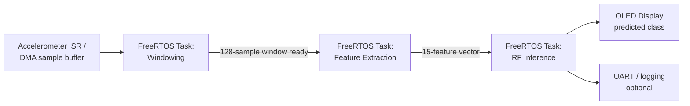

# Edge AI Motor Fault Detection — STM32F446RE

Real-time vibration-based fault classification on a bare-metal / FreeRTOS
embedded target, with a flash-budget-aware Random Forest trained offline
on hand-collected accelerometer data.

---

## Features

- **On-device, real-time inference** — no host PC in the loop at runtime.
  Classification runs directly on the STM32F446RE from live accelerometer
  windows.
- **4-class motor condition classification** — `Healthy`, `Bearing_Fault`,
  `Imbalance`, `Transient_Shock`.
- **Live OLED status display** — current predicted class shown on-device
  as it updates, so the classifier's output is human-readable at the
  hardware without a serial console.
- **FreeRTOS multi-task pipeline** — sampling, feature extraction, and
  inference run as separate tasks rather than a single blocking loop.
- **Flash-budget-constrained model selection** — the training pipeline
  doesn't just optimize F1; it rejects any Random Forest whose serialized
  node count won't fit the target's flash allocation (400 KB), so the
  model that gets exported is guaranteed deployable, not just accurate.
- **Fully custom feature pipeline** — no black-box TFLite Micro / X-CUBE-AI
  runtime. Features and inference are both hand-implemented, giving full
  control over memory footprint and latency on a Cortex-M4 with no FPU
  acceleration reliance beyond what the toolchain provides.

---

## System Architecture

### Offline: data → trained model

```mermaid
flowchart LR
    A[Accelerometer<br/>on test rig] -->|UART, 0xAA 0x55 sync frame| B[PC: Serial Capture<br/>process_data.ipynb]
    B --> C[Raw XYZ samples<br/>÷16384 → g-units]
    C --> D[Windowing<br/>128 samples, non-overlapping<br/>demeaned per window]
    D --> E[Feature Extraction<br/>Variance, RMS, PtP,<br/>Dominant FFT bin, Spectral Crest<br/>× 3 axes = 15 features]
    E --> F[Per-class CSVs<br/>final_&lt;class&gt;_dataset.csv]
    F --> G[master_dataset.csv<br/>17,731 labeled rows]
    G --> H[Random Forest search<br/>constrained by MIN_F1_SCORE<br/>+ MAX_FLASH_BYTES]
    H --> I[Exported model params<br/>→ C arrays for firmware]
```



### Runtime: on-device inference



---

## Data Collection

Vibration data is captured from an accelerometer over UART, framed and
parsed on a PC before any feature engineering happens:

1. **Framing** — each packet is preceded by a `0xAA 0x55` sync marker.
   The host hunts for that marker byte-by-byte to stay aligned, then reads
   a fixed 6000-byte payload per packet (1000 samples × 3 axes × 2 bytes,
   big-endian `int16`).
2. **Scaling** — raw accelerometer counts are divided by `16384.0` to
   convert to g-units (standard ±2 g full-scale LSB sensitivity).
3. **Per-class capture** — each of the four condition classes
   (`Healthy`, `Bearing_Fault`, `Imbalance`, `Transient_Shock`) is
   recorded in its own set of session files, several independent sessions
   per class to avoid a single run's noise characteristics dominating
   the dataset.
4. **Windowing** — each session is cut into **128-sample non-overlapping
   windows**. Each window is demeaned (per-axis mean subtracted) before
   any feature is computed, so DC offset from sensor mounting doesn't
   leak into the amplitude features.
5. **Feature extraction per window** (15 features total — 5 statistics
   × 3 axes):

   | Feature | What it captures |
   |---|---|
   | Variance | Overall mechanical stability / vibration energy |
   | RMS | Average vibration magnitude |
   | Peak-to-Peak (PtP) | Displacement / shock amplitude |
   | Dominant FFT bin | Which frequency the vibration energy concentrates at |
   | Spectral Crest Factor | Peak-to-mean ratio in the frequency domain — separates sharp impacts from continuous, broadband vibration |

6. **Consolidation** — per-class feature CSVs are concatenated into
   `master_dataset.csv`: **17,731 rows** across the four classes.

   | Class | Rows |
   |---|---|
   | Imbalance | 4,685 |
   | Healthy | 4,677 |
   | Bearing_Fault | 4,669 |
   | Transient_Shock | 3,700 |

   `Transient_Shock` has ~20% fewer samples than the other three classes —
   worth accounting for (class weighting or additional collection) since
   it's also the hardest class for the trained model to separate from
   `Healthy`.

---

## Feature Visualization

`process_data.ipynb` plots four per-class boxplots (Variance, PtP,
Dominant frequency bin, Spectral Crest) to sanity-check that the features
actually separate the classes before spending time on model search.
Grounded in the actual per-class Z-axis medians:

| Class | Variance | PtP | Dominant bin | Spectral Crest |
|---|---|---|---|---|
| Bearing_Fault | 0.001 | 0.185 | **38** | 5.1 |
| Healthy | 0.000 | 0.076 | 8 | 6.9 |
| Imbalance | **0.034** | **0.551** | 6 | **20.8** |
| Transient_Shock | 0.000 | 0.099 | 8 | 7.5 |

What these numbers show:

- **`Imbalance` is the easiest class to separate** — it stands well apart
  on every axis (variance, PtP, and spectral crest all far above the
  other three), which lines up with the near-perfect recall/precision
  (~1.00) the trained model achieves on this class.
- **`Bearing_Fault` shows a distinct dominant-frequency signature**
  (bin 38 vs. 6–8 for everything else) — bearing defects excite
  higher-frequency harmonics than the other conditions, which is exactly
  the kind of separation the FFT-based features were included to catch.
- **`Healthy` and `Transient_Shock` sit close together** on variance, PtP,
  and dominant bin — a transient shock is a brief event, so once it's
  averaged over a 128-sample window it can look statistically similar to
  a quiet, healthy window on everything except spectral crest (7.5 vs.
  6.9), which is a weaker signal than the separations the other classes
  get. This is consistent with where the trained model actually makes
  its mistakes — most of its Transient_Shock and Bearing_Fault errors
  are confusions with Healthy.

---

## Model Training & Selection

The model isn't just picked on F1 — it's selected under an explicit
**flash budget constraint**, since it has to fit on the STM32F446RE
alongside the FreeRTOS firmware:

```python
MAX_FLASH_BYTES = 400 * 1024   # firmware flash budget for the model
MIN_F1_SCORE    = 0.90         # macro-F1 floor
MAX_DEPTH_MIN, MAX_DEPTH_MAX           = 5, 12
MAX_FEATURES_MIN, MAX_FEATURES_MAX     = 3, 11
N_ESTIMATORS_MIN, N_ESTIMATORS_MAX     = 50, 200
MIN_SAMPLES_LEAF_MIN, MIN_SAMPLES_LEAF_MAX = 1, 10

X = master_data.loc[:, "Variance_X":"Spec_Crest_Z"]
y = master_data["Label"]
X_train, X_test, y_train, y_test = train_test_split(
    X, y, test_size=0.3, random_state=42, stratify=y
)

rf = RandomForestClassifier(n_jobs=-1, oob_score=True, random_state=42)
fold = StratifiedKFold(n_splits=3, shuffle=True, random_state=42)

rf_param_grid = {
    "max_depth": stats.randint(MAX_DEPTH_MIN, MAX_DEPTH_MAX),
    "max_features": stats.randint(MAX_FEATURES_MIN, MAX_FEATURES_MAX),
    "min_samples_leaf": stats.randint(MIN_SAMPLES_LEAF_MIN, MIN_SAMPLES_LEAF_MAX),
    "n_estimators": stats.randint(N_ESTIMATORS_MIN, N_ESTIMATORS_MAX),
}

cv = RandomizedSearchCV(
    estimator=rf, scoring="f1_macro", param_distributions=rf_param_grid,
    n_iter=30, cv=fold, random_state=42, n_jobs=4,
)
cv.fit(X_train, y_train)

# Every candidate above MIN_F1_SCORE is re-fit and measured for
# actual serialized size (nodes × 12 bytes/node) before it's allowed
# to be considered "viable" — F1 alone doesn't get a model shipped.
results = pd.DataFrame(cv.cv_results_)
results = results[results["mean_test_score"] >= MIN_F1_SCORE]

viable_models = []
for _, row in results.iterrows():
    temp_model = RandomForestClassifier(
        max_depth=row["param_max_depth"],
        max_features=row["param_max_features"],
        n_estimators=row["param_n_estimators"],
        min_samples_leaf=row["param_min_samples_leaf"],
        random_state=42,
    )
    temp_model.fit(X_train, y_train)
    total_nodes = sum(t.tree_.node_count for t in temp_model.estimators_)
    flash_bytes = total_nodes * 12

    if flash_bytes <= MAX_FLASH_BYTES:
        viable_models.append({
            "params": row["params"],
            "score": row["mean_test_score"],
            "nodes": total_nodes,
            "flash_kb": flash_bytes / 1024,
        })

best_model = pd.DataFrame(viable_models).sort_values("score", ascending=False).iloc[0]
```

## Final Model & Results

```python
main_model = RandomForestClassifier(
    max_depth=best_model["params"]["max_depth"],
    max_features=best_model["params"]["max_features"],
    n_estimators=best_model["params"]["n_estimators"],
    min_samples_leaf=best_model["params"]["min_samples_leaf"],
    random_state=42,
)
main_model.fit(X_train, y_train)
preds = main_model.predict(X_test)
```

| Metric | Train | Test |
|---|---|---|
| Accuracy | 0.959 | 0.937 |
| Macro F1 | 0.957 | 0.936 |

| Class | Precision | Recall | F1 | Support |
|---|---|---|---|---|
| Bearing_Fault | 0.92 | 0.92 | 0.92 | 1401 |
| Healthy | 0.89 | 0.94 | 0.91 | 1403 |
| Imbalance | 1.00 | 1.00 | 1.00 | 1406 |
| Transient_Shock | 0.94 | 0.88 | 0.91 | 1110 |

The main confusion is `Bearing_Fault`/`Transient_Shock` being mistaken
for `Healthy` (a missed-fault error, not a false alarm) — see the
feature visualization section above for why: those two classes overlap
with `Healthy` on most window-averaged statistics and rely more heavily
on the spectral crest feature, which separates them less cleanly than
the other features separate `Imbalance`.

---

## Repository Contents

| File | Purpose |
|---|---|
| `process_data.ipynb` | Serial capture, windowing, feature extraction, model search and export |
| `master_dataset.csv` | Consolidated, labeled feature dataset (17,731 rows × 15 features) |

---

## Status

- **Done:** data collection protocol, feature extraction pipeline, model
  search under flash constraint, trained + evaluated Random Forest
  (0.936 test macro-F1).
- **In progress:** on-device FreeRTOS task integration and OLED display
  wiring — the section above documents the intended architecture and
  interface, not a validated firmware build.
