# 🛠️ TinyML Motor Fault Detection — STM32F446RE

**Real-time, on-device vibration classification for predictive maintenance.**
An STM32F446RE samples a motor's vibration with an MPU6050 accelerometer, extracts
15 time- and frequency-domain features from each 128-sample window using CMSIS-DSP,
and classifies the motor's mechanical condition with a Random Forest running
**entirely on the microcontroller** — no host PC and no cloud in the loop at runtime.
Live status is shown on an onboard SSD1306 OLED and mirrored over UART.


> 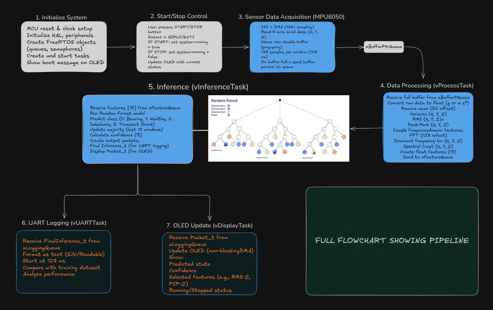

---

## ✨ Highlights

- **On-device inference** — the Random Forest classifies live vibration windows directly on the Cortex-M4; the PC is only used for data collection, training, and debugging.
- **4-class condition monitoring** — `Healthy`, `Bearing_Fault`, `Imbalance`, `Transient_Shock`.
- **Full custom DSP + feature pipeline** — no TFLite-Micro / X-CUBE-AI black box. Features are hand-implemented with CMSIS-DSP and **bit-for-bit matched to the Python training pipeline** (scaling, per-window de-meaning, variance convention, and FFT-magnitude reconstruction all verified against NumPy/SciPy).
- **FreeRTOS pipeline** — acquisition, feature extraction, inference, telemetry, and the OLED display all run as separate tasks connected by queues and ISR-safe notifications.
- **Zero-copy DMA acquisition** — I²C reads are driven by the sensor's data-ready interrupt straight into a ping-pong buffer via DMA.
- **On-device OLED status display** — a second, independent I²C bus (I²C3, DMA-flushed) drives an SSD1306 with live fault state, confidence, and Z-axis vibration stats, decoupled from the acquisition/inference path by its own FreeRTOS task and queue.
- **Deployment-aware model selection** — the training search rejects any forest whose serialized size exceeds the target's flash budget, so the exported model is chosen to be deployable, not just accurate.
- **Honest, debugged, real-world project** — includes a documented domain-shift investigation (a mechanical mounting change measurably shifted the feature distribution) and a full sensor-to-inference debugging methodology.

### 📊 At a glance

| | |
|---|---|
| **Target** | STM32F446RE (Cortex-M4F @ 16 MHz HSI) |
| **Sensor** | MPU6050, ±2 g, 1 kHz, DLPF 42 Hz |
| **Window** | 128 samples → 128 ms → 128-pt real FFT (65 bins, Δf = 7.8125 Hz) |
| **Features** | 15 (Variance, RMS, Peak-to-Peak, Dominant FFT bin, Spectral Crest × X/Y/Z) |
| **Model** | Random Forest — 70 trees, depth 11, exported to C via `emlearn` |
| **Held-out test** | 0.937 accuracy · 0.936 macro-F1 (4 classes) |
| **Dataset** | 17,731 labeled feature windows |

---

## 🧭 Table of Contents

1. [System Architecture](#-1-system-architecture)
2. [Hardware & Wiring](#-2-hardware--wiring)
3. [How It Works](#-3-how-it-works)
4. [Results](#-4-results)
5. [Real-World Insight: Mounting-Induced Domain Shift](#-5-real-world-insight-mounting-induced-domain-shift)
6. [Engineering Deep-Dives](#-6-engineering-deep-dives)
7. [Repository Structure](#-7-repository-structure)
8. [Build & Flash](#-8-build--flash)
9. [Reproducibility](#-9-reproducibility)
10. [Limitations & Future Work](#-10-limitations--future-work)
11. [Skills Demonstrated](#-11-skills-demonstrated)
12. [License & Acknowledgements](#-12-license--acknowledgements)

---

## 🏗️ 1. System Architecture

The project has two halves that share **one identical feature-extraction contract**: an
offline path that collects data and trains the model, and a runtime path that runs the
frozen model on the MCU.

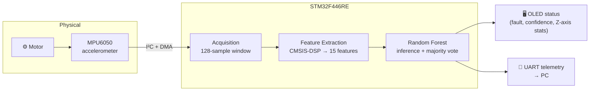

> 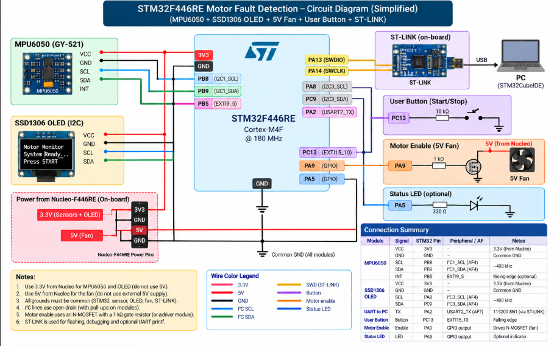

### Runtime firmware architecture (FreeRTOS)

Every stage is decoupled: hardware events happen in short ISRs, and all the real work is
done in tasks that communicate through queues. This keeps the ISRs short and the pipeline
back-pressured and testable.

## 🔌 2. Hardware & Wiring

### Bill of materials

| Component | Role |
|---|---|
| STM32F446RE (Nucleo-64) | Main MCU — acquisition, DSP, inference |
| MPU6050 | 3-axis accelerometer (I²C) |
| SSD1306 OLED (128×64, I²C) | On-device status display |
| Motor / fan under test | Machine being monitored |
| USB–UART (ST-Link VCP) | Data collection, telemetry, debugging |

### Pin map *(extracted from firmware — authoritative)*

| Signal | Pin | Peripheral / AF | Notes |
|---|---|---|---|
| MPU6050 **SCL** | `PB8` | I²C1_SCL (AF4) | ~400 kHz fast mode |
| MPU6050 **SDA** | `PB9` | I²C1_SDA (AF4) | open-drain |
| MPU6050 **INT** | `PB5` | EXTI9_5, input pull-down, **rising** edge | data-ready trigger |
| OLED **SCL** | `PA8` | I²C3_SCL (AF4) | ~400 kHz fast mode |
| OLED **SDA** | `PC9` | I²C3_SDA (AF4) | open-drain |
| UART **TX** | `PA2` | USART2_TX (AF7) | 115200 8N1, via DMA1_S6 |
| User **button** | `PC13` | EXTI15_10, **falling** edge | start / stop acquisition |
| **Motor enable** | `PA9` | GPIO output | toggled in `vStartStopSys` (`BS9`/`BR9`) |
| Status LED | `PA5` | GPIO output | buffer / heartbeat toggle on each DMA1_Stream0 completion |

- **MPU6050 I²C address:** `0x68` (write `0xD0`, read `0xD1`)
- **OLED I²C address:** set via `OLED_ADDR` in `ssd1306.h` (not included in this update — confirm it matches your module, typically `0x3C` or `0x3D`)
- **DMA map:** `DMA1_Stream0 Ch1` = I²C1-RX (sensor) · `DMA1_Stream4 Ch3` = I²C3-TX (OLED) · `DMA1_Stream6 Ch4` = USART2-TX (telemetry)


> 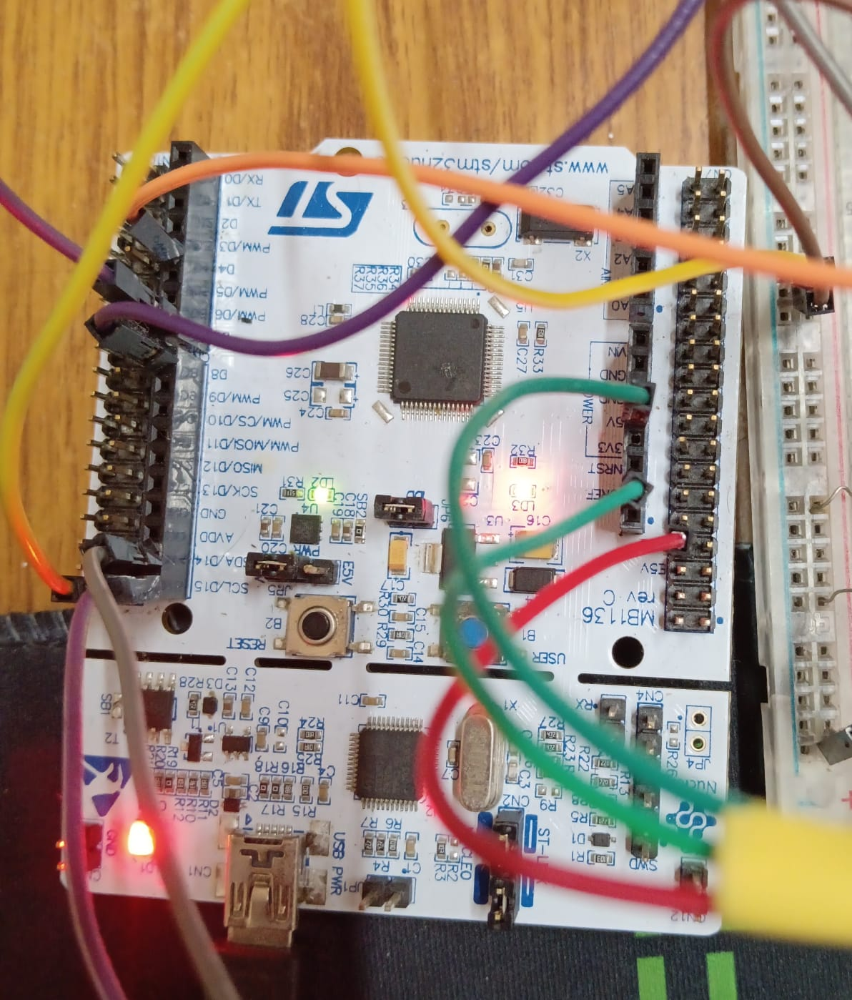

---

## ⚙️ 3. How It Works

### 3.1 Data acquisition — interrupt-driven, DMA, ping-pong

The MPU6050 is configured for a **1 kHz** data-ready interrupt. Each interrupt starts a
6-byte burst read (`X/Y/Z`, big-endian `int16`); the START condition, slave address, and
target-register handshake are done as blocking polled I²C inside the ISR, then the actual
6-byte payload is handed to DMA, which writes it straight into the active buffer. When one
buffer fills with a full window, its pointer is handed to the processing task and the other
buffer takes over — a zero-copy ping-pong for the payload itself.

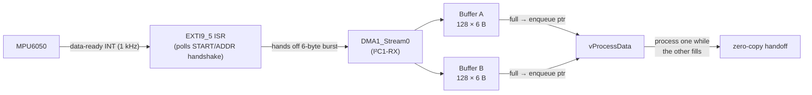

> **Data collection vs. inference:** during dataset collection the firmware streams larger
> `0xAA 0x55`-framed buffers over UART and the PC cuts them into 128-sample windows. On the
> inference build, the window **is** the 128-sample DMA buffer, so the on-device window
> exactly matches the training window.

### 3.2 Feature engineering — 15 features per window

Each 128-sample, 3-axis window is **de-meaned per axis** (removing the gravity/DC component
that depends on sensor orientation), then reduced to 15 features. Feature order is fixed and
identical between Python and firmware.

| # | Feature (× X/Y/Z) | Captures |
|---|---|---|
| 1–3 | **Variance** | Vibration energy / mechanical stability |
| 4–6 | **RMS** | Average vibration magnitude |
| 7–9 | **Peak-to-Peak** | Shock / displacement amplitude |
| 10–12 | **Dominant FFT bin** | Where spectral energy concentrates (bin `k` → `k × 7.8125 Hz`) |
| 13–15 | **Spectral Crest Factor** | Peak-to-mean ratio in frequency domain — separates sharp impacts from broadband vibration |

<details>
<summary>Feature math (Python reference, reproduced on-device)</summary>

```python
window = window - window.mean(axis=0)          # per-axis de-mean (remove DC/gravity)
variance = np.var(window, axis=0)              # population variance (ddof=0)
rms      = np.sqrt(np.mean(window**2, axis=0))
ptp      = np.ptp(window, axis=0)
mags     = np.abs(np.fft.rfft(window, axis=0)) # 65 magnitude bins for a 128-pt window
dominant = np.argmax(mags, axis=0)             # dominant bin index
crest    = np.max(mags, axis=0) / (np.mean(mags, axis=0) + 1e-8)
```

On the STM32 these map to `arm_mean_f32` / `arm_offset_f32` / `arm_var_f32` / `arm_rms_f32` /
`arm_max_f32` / `arm_min_f32` / `arm_rfft_fast_f32`, with two subtleties handled explicitly:
a variance-convention correction (`×(N−1)/N`, since CMSIS uses `ddof=1` and NumPy defaults to
`ddof=0`) and manual reconstruction of the packed real-FFT output into 65 magnitude bins.
See [§6 Engineering Deep-Dives](#-6-engineering-deep-dives).
</details>

### 3.3 Model training & deployment-aware selection

```mermaid
flowchart LR
    A["Raw XYZ (UART)"] --> B["÷16384 → g"]
    B --> C["128-sample windows<br/>non-overlap · de-meaned"]
    C --> D["15 features/window"]
    D --> E["master_dataset.csv<br/>17,731 × 15"]
    E --> F["RandomizedSearchCV<br/>(f1_macro, StratifiedKFold)"]
    F --> G["Reject forests over<br/>flash node-budget"]
    G --> H["Best viable RF"]
    H --> I["emlearn → rf_model.h<br/>(inline C)"]
    I --> J["Compile & flash"]
```

The search doesn't just maximize F1 — every candidate above the F1 floor is re-fit and its
**serialized node count** is checked against the flash budget, so only deployable forests are
considered. Final hyper-parameters:

```python
RandomForestClassifier(n_estimators=70, max_depth=11,
                       max_features=6, min_samples_leaf=8, random_state=42)
```

The model is exported to C with [`emlearn`](https://github.com/emlearn/emlearn)
(`method='inline'`), producing `rf_model.h` with a `rf_model_predict()` that the firmware
calls directly. *(Actual flash footprint is measured from the linker `.map` — see [§8](#-8-build--flash).)*

### 3.4 On-device inference & majority voting

`vRunInference` runs the forest on each 15-feature vector and returns a class index
(`0=Bearing_Fault, 1=Healthy, 2=Imbalance, 3=Transient_Shock` — this mapping is fixed and
must match training). Because a single 128 ms window can be noisy, predictions are stabilized
by **majority vote** across a short run of windows before the result is reported — both over
UART and, every 10th window, to the OLED.

```
Window 1 → Healthy
Window 2 → Healthy
Window 3 → Bearing Fault     ⇒  Majority = Healthy
Window 4 → Healthy
Window 5 → Healthy
```

### 3.5 UART telemetry protocol

Each processed window emits one fixed 68-byte record over UART (little-endian), letting the
PC reconstruct the exact on-device feature vector and predictions for validation:

```c
typedef struct __attribute__((packed)) {
    float   features[15];      // 60 B — the on-device feature vector
    int32_t prediction;        //  4 B — per-window class
    int32_t maj_vote_prediction; // 4 B — stabilized class
} FinalInference_t;            // = 68 B
```

```python
raw = ser.read(68)
features   = np.frombuffer(raw[:60],  dtype="<f4")
prediction = np.frombuffer(raw[60:64], dtype="<i4")[0]
majority   = np.frombuffer(raw[64:68], dtype="<i4")[0]
```

> >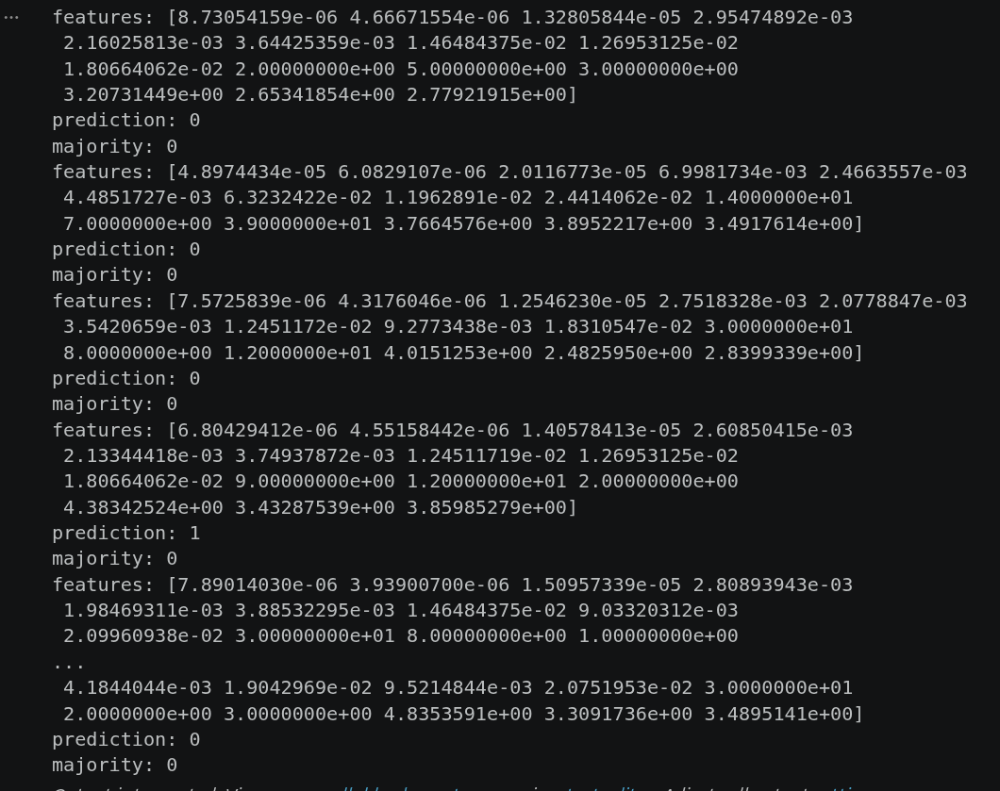

### 3.6 OLED status display

Every 10th inference window, `vRunInference` packages the majority-vote class, its confidence
(`hits / 10 × 100`), and the current window's Z-axis RMS and peak-to-peak into a small
`DisplayPacket_t` and enqueues it to `vDisplayTask` — a dedicated FreeRTOS task, fully
decoupled from acquisition and inference so a slow display refresh can never stall sampling.

```c
typedef struct __attribute__((packed)) {
    float   confidence;
    int32_t idx;
    float   PTP_Z;
    float   RMS_Z;
} DisplayPacket_t;
```

`vDisplayTask` renders four lines into a software framebuffer using a hand-rolled 5×8 bitmap
font, then flushes the frame over a **second, independent I²C bus (I²C3)** via DMA
(`DMA1_Stream4`), so the OLED write can never contend with the MPU6050's I²C1 traffic. Startup
and error states (`welcome_message()`, `show_Ack_failure()`) use the same framebuffer/flush
path before the RTOS scheduler or acquisition even starts.

>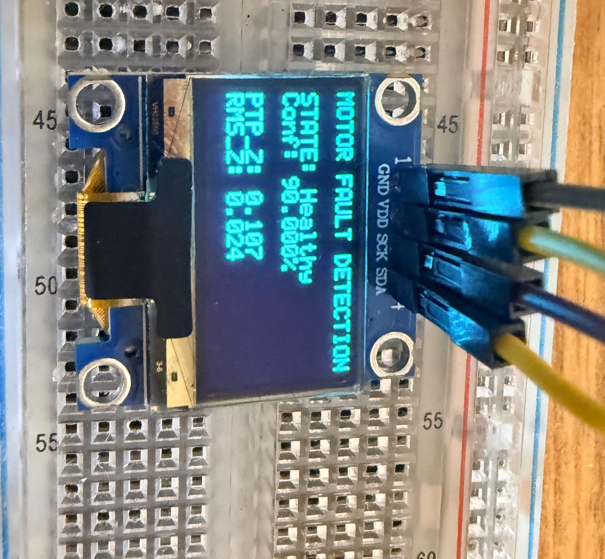

---

## 📈 4. Results

**Offline evaluation** on a held-out stratified test split (30%, 5,320 windows):

| Metric | Train | Test |
|---|---|---|
| Accuracy | 0.959 | **0.937** |
| Macro-F1 | 0.957 | **0.936** |

| Class | Precision | Recall | F1 | Support |
|---|---|---|---|---|
| Bearing_Fault | 0.92 | 0.92 | 0.92 | 1401 |
| Healthy | 0.89 | 0.94 | 0.91 | 1403 |
| Imbalance | 1.00 | 1.00 | 1.00 | 1406 |
| Transient_Shock | 0.94 | 0.88 | 0.91 | 1110 |

- **`Imbalance` separates almost perfectly** — high variance, PtP, and spectral crest set it far apart from the rest.
- **Remaining confusion is `Bearing_Fault`/`Transient_Shock` vs `Healthy`** — i.e. missed-fault errors rather than false alarms — because those classes overlap with `Healthy` on window-averaged statistics and lean on the weaker spectral-crest signal.

**On-device consistency check:** running identical feature windows through the offline
scikit-learn model and the on-device `emlearn` C model, predictions agreed on **~993 / 1000**
windows — evidence that the C port faithfully reproduces the trained model, which cleanly
separates *implementation* bugs from *real* changes in the incoming vibration data.

> **go to /ML/process_data.ipynb for boxplots and detailed comparison between features.**

---

## 🔬 5. Real-World Insight: Mounting-Induced Domain Shift

A genuinely instructive finding: after a mechanical mounting change (glue removed from the
sides, slight sensor re-orientation), the **Healthy** vibration distribution shifted
measurably even though the motor looked fine to the eye:

| Feature | Training Healthy | New live | ≈ Change |
|---|---|---|---|
| Variance Z | 2.28e-04 | 8.60e-04 | ~3.8× |
| RMS Z | 0.0151 | 0.0293 | ~1.9× |
| PtP Z | 0.0764 | 0.1351 | ~1.8× |

Because every window is de-meaned, static tilt/gravity is largely removed — so the amplitude
shift points to **altered mechanical coupling**, not orientation. The takeaway (and a core
lesson of vibration-based ML): **the sensor mounting is part of the measurement system**, and
a classifier's "Healthy" is only the *distribution it was trained on*. If deployment mounting
differs from training mounting, the Healthy set must be re-collected in the deployment
configuration.

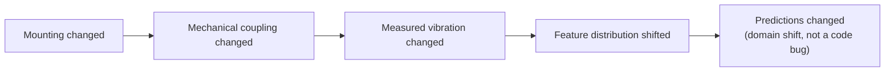
---

## 🔧 6. Engineering Deep-Dives

<details>
<summary><b>FFT initialization returned <code>ARM_MATH_ARGUMENT_ERROR</code></b></summary>

`arm_rfft_fast_init_f32()` initially failed (`fftLenRFFT = 0`, `pTwiddleRFFT = NULL`) because
the CMSIS-DSP FFT twiddle tables for the selected length weren't compiled in. Fix: add
`ARM_ALL_FFT_TABLES` (and the DSP table config) to the preprocessor symbols. After that the
128-pt RFFT initialized and produced valid output.
</details>

<details>
<summary><b>Variance mismatch between CMSIS-DSP and NumPy</b></summary>

`arm_var_f32` uses the sample convention (`ddof=1`) while training used `np.var` (`ddof=0`).
The firmware multiplies the CMSIS result by `(N−1)/N` so the on-device variance matches the
population variance the model was trained on.
</details>

<details>
<summary><b>Real-FFT magnitude buffer sizing (65, not 128)</b></summary>

A 128-pt real FFT yields `N/2 + 1 = 65` unique magnitude bins. CMSIS packs the output with the
DC term in `fft[0]` and the Nyquist term in `fft[1]`; the rest are interleaved real/imag pairs.
The code reconstructs a proper 65-element magnitude array (special-casing bins 0 and 64) to
avoid out-of-bounds reads in `arm_max_f32`/`arm_mean_f32`.
</details>

<details>
<summary><b>Debugging philosophy: debug the whole chain, not just the model</b></summary>

Not every wrong prediction is an ML problem. The triage order that worked: class mapping →
feature ordering → numerical formulas → FFT init → buffer sizes → variance convention → raw
sensor decode → Python-vs-MCU agreement → training-vs-live distribution → mechanical mounting.
This is what let a *domain shift* be distinguished from a *software bug*.
</details>

---

## 📂 7. Repository Structure

```text
Motor_Fault_Detection/
├── README.md
├── .gitignore
├── Data_Collection/          # STM32 firmware: acquire + stream raw vibration over UART
│   ├── Src/  Inc/  Startup/
├── Inference/                # STM32 firmware: FreeRTOS + CMSIS-DSP + on-device RF + OLED
│   ├── Src/{main.c, Drivers/, CMSIS_DSP/}
│   ├── Inc/{Header/, include/ (FreeRTOS), CMSIS/}
│   └── Startup/
├── ML/
│   ├── process_data.ipynb    # capture, windowing, features, model search, C export
│   ├── serial_read.ipynb     # live UART validation
│   ├── rf_model.h            # exported C model (also copied into Inference/Inc/Header)
│   └── best_model.pkl / .npy
└── Data_Collection/Data/     # per-class raw + feature CSVs, master_dataset.csv
```

> **Note:** `Inference/Inc/{CMSIS,include}` are vendored ARM CMSIS / FreeRTOS sources brought
> in by STM32CubeIDE. The hand-written code lives in `*/Src/` and `Inference/Inc/Header/`.

---

## 🚀 8. Build & Flash

**Firmware (STM32CubeIDE)**
1. `File → Import → Existing Projects into Workspace`, select `Data_Collection/` and/or `Inference/`.
2. Ensure preprocessor symbols include the CMSIS-DSP FFT tables: **`ARM_ALL_FFT_TABLES`** (and `ARM_MATH_CM4`, `__FPU_PRESENT=1`).
3. Build (`Debug` or `Release`) and flash to the Nucleo via ST-Link.
4. Check real flash/RAM usage in `Inference/<config>/*.map` (look at `.text` / `.bss`).

**Python (training / validation)**
```bash
python -m venv .venv && source .venv/bin/activate
pip install numpy pandas scipy scikit-learn matplotlib seaborn pyserial emlearn joblib python-dotenv
# create a .env with:  port=/dev/ttyACM0   (and main_path=... for dataset building)
jupyter notebook ML/process_data.ipynb
```

---

## 🔁 9. Reproducibility

| Parameter | Value | | Parameter | Value |
|---|---|---|---|---|
| Sampling rate | 1 kHz | | RF trees | 70 |
| Window size | 128 samples (128 ms) | | Max depth | 11 |
| FFT size / bins | 128 / 65 | | Max features | 6 |
| Freq. resolution | 7.8125 Hz | | Min leaf samples | 8 |
| Features | 15 | | `random_state` | 42 |
| Accel range | ±2 g (16384 LSB/g) | | Test split | 30% stratified |

---

## ⚠️ 10. Limitations & Future Work

- **Mounting dependency / domain shift** — the vibration signature depends on mechanical
  coupling; the model should be (re)trained in the deployment configuration.
- **Validation split** — current metrics use a stratified *random* split over pooled windows.
  Next step: **session-grouped cross-validation** (`GroupKFold` on recording session) to rule
  out window-level correlation between train and test and harden the generalization estimate.
- **`Transient_Shock` recall** — the weakest class; needs more/harder examples and possibly
  class weighting.
- **Prediction ≠ physical proof** — a class prediction reflects the learned feature
  distribution, not a verified physical fault.

**Roadmap:** wire up the OLED busy-flag guard · move OLED DMA completion off the busy-wait ·
add a confidence/abstain threshold for out-of-distribution windows · session-grouped CV ·
CRC-framed UART telemetry · pinned training environment for reproducible model export.

---

## 🧠 11. Skills Demonstrated

**Embedded:** bare-metal STM32 register programming · I²C + DMA + UART + EXTI · dual
independent I²C buses (sensor + display) · hand-rolled SSD1306 driver (bit-banged command
phase, DMA-flushed framebuffer) · FreeRTOS (tasks, queues, ISR-safe notifications, correct
syscall-priority configuration) · zero-copy ping-pong buffering · FPU enablement.
**DSP:** windowing · de-meaning · variance/RMS/PtP · CMSIS-DSP real FFT · spectral features.
**Edge AI / ML:** feature engineering · Random Forest training & tuning · deployment-constrained
model selection · C-code model export (`emlearn`) · Python↔MCU parity validation · domain-shift analysis.

---

## 📜 12. License & Acknowledgements

- Hand-written firmware, notebooks, and dataset: © the author — **Shaurya Singh (IIST ECE'28)**
- Vendored third-party code retains its own license: **ARM CMSIS / CMSIS-DSP** (Apache-2.0),
  **FreeRTOS** (MIT), **emlearn** (MIT).
>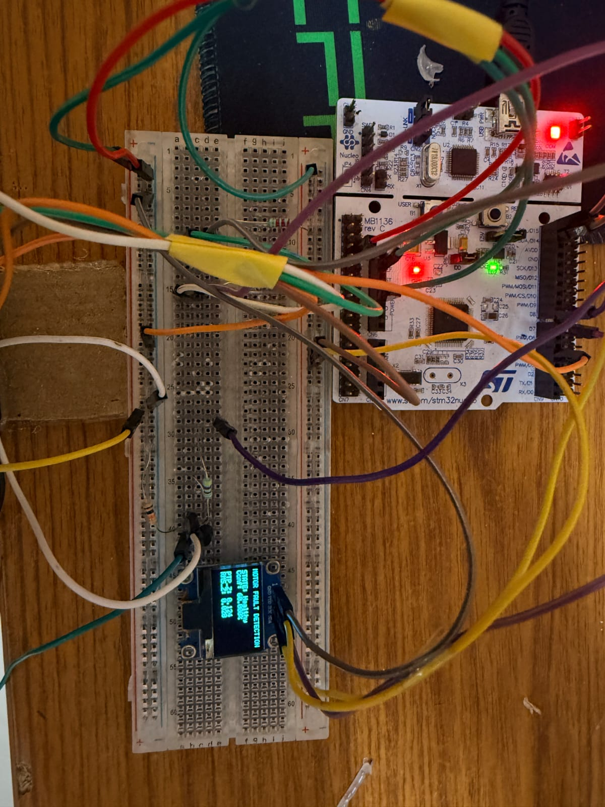 | 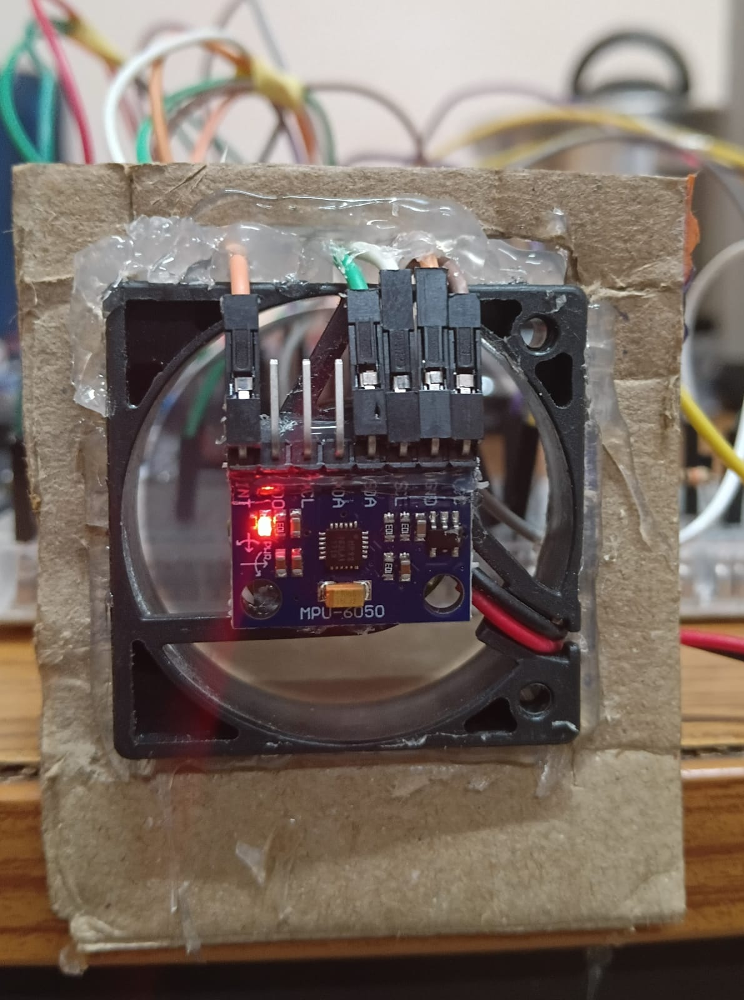
